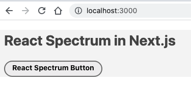

# next-with-react-spectrum-test

This is an example repo to show how to integrate [React Spectrum][] into a
[Next.js][] app using my proposed React Spectrum changes ([pull request][]).

## Run

```sh
brew install gh

gh repo clone adobe/react-spectrum && cd react-spectrum && gh pr checkout 2696
nvm use && npm install --legacy-peer-deps
npm link

gh repo clone msabramo/next-with-react-spectrum-test
nvm use
npm install
npm link react-spectrum-monorepo
npm run dev
```

The result should be something like this:



[React Spectrum]: https://react-spectrum.adobe.com/react-spectrum/
[Next.js]: https://nextjs.org/
[pull request]: https://github.com/adobe/react-spectrum/pull/2696


